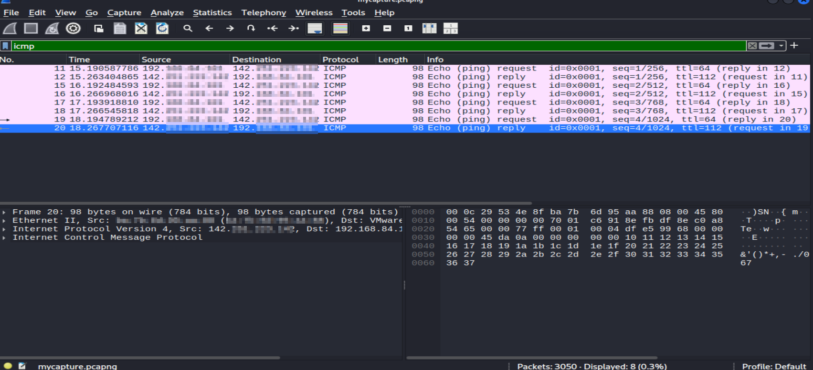
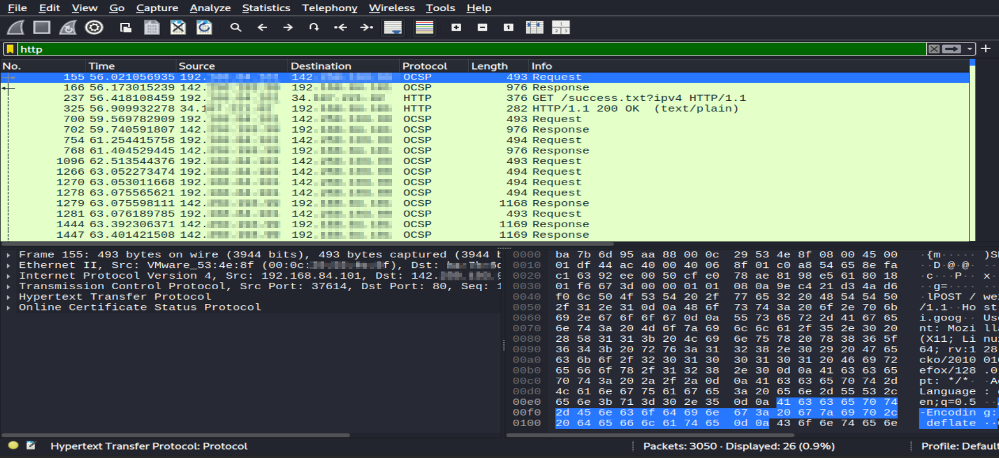

# wireshark-analysis
##  Objective
- Capture and analyze network traffic using Wireshark to identify protocols, IPs, and packet details.
---

## Tools Used
- **Wireshark** (GUI packet analyzer)
- **Kali Linux** (Operating System)

---
## Steps Performed
### 1. Verify Wireshark Installation
```bash
wireshark --version
````

* If not installed:

```bash
sudo apt update
sudo apt install wireshark -y
```

### 2. Launch Wireshark

* Open via Kali menu or:

```bash
wireshark &
```

### 3. Select Network Interface

* `wlan0` → Wireless connection
* `eth0` → Wired connection

### 4. Start Packet Capture

* Double-click desired interface
* Observe live packet capture

### 5. Generate Test Traffic

```bash
ping -c 4 google.com
curl http://example.com
```

* Also browsed a website to generate HTTP/DNS traffic

### 6. Stop & Save Capture

* Stop capture with **red square**
* Save as `task5_capture.pcap`

### 7. Analyze Traffic

* Applied filters:

```plaintext
icmp
http
dns
```

* Followed a TCP stream for HTTP request/response analysis

---
## Key Observations

* **ICMP:** Ping requests/replies to Google servers
* **DNS:** Hostname resolution queries and responses
* **HTTP:** GET requests to example.com
* **TCP Streams:** Showed plain-text HTTP communication

---
## Protocol Details

### ICMP (Internet Control Message Protocol)

* Used for sending diagnostic or control messages between network devices.
* Commonly used by the `ping` command to check connectivity.

### DNS (Domain Name System)

* Resolves human-readable domain names (like `google.com`) into IP addresses.
* DNS packets show query type, domain name, and resolved IP.

### HTTP (Hypertext Transfer Protocol)

* Protocol for transferring web pages between a client and server.
* In unsecured HTTP, data (including headers and content) is transmitted in plain text.

---
## Scan Summary

During the capture, Wireshark recorded multiple types of network traffic, including ICMP pings, DNS lookups, and HTTP requests.
The analysis confirmed successful connectivity to remote hosts, proper DNS resolution, and unencrypted HTTP communication.
This traffic was isolated using protocol filters, making it easy to identify the purpose and content of each packet exchange.

---

## Screenshots
### Live Capture


### ICMP Filter View



### HTTP Filter View



### DNS Filter View


### TCP Stream Conversation


---
##  Conclusion

- Wireshark enables deep inspection of network traffic, helping in protocol analysis, IP tracking, and troubleshooting.
  Filters make it easier to isolate relevant traffic for investigation, and TCP stream following provides a complete picture of communication between endpoints.
---
